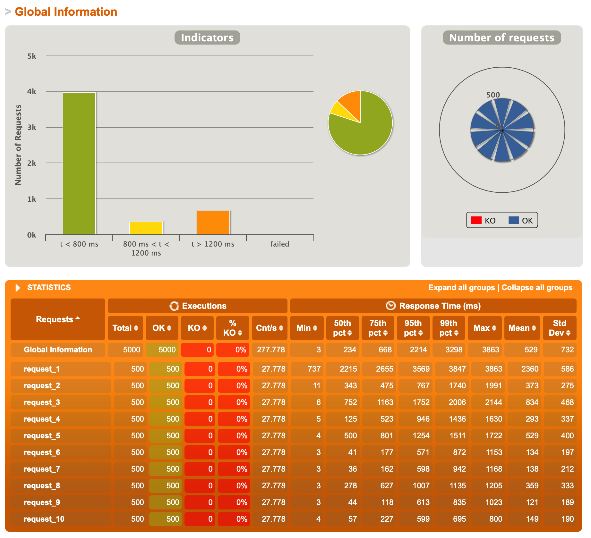

# 实验报告

- 运行环境： Apple M1（ARM架构，16G内存），使用Docker运行POS服务器、Redis集群；
- 压力测试：模拟用户每隔1秒钟将一个商品添加到购物车，总共添加10个商品。


## 1. Docker镜像

使用spring boot的插件可以直接创建Docker镜像：

```shell
$ mvn spring-boot:build-image
```

但是这个指令在ARM架构的电脑上有问题，会编译出x86架构的镜像出来，导致运行非常缓慢。
所以我参考了[Stackoverflow上的这个提问](https://stackoverflow.com/questions/69526553/how-do-i-define-architecture-arm64-when-building-the-docker-image-through-maven)，
改成用自己写的Dockerfile生成镜像，直接运行打包的jar文件，容器就能以较为正常的效率运行了。

测试使用1个POS服务器（限制1CPU运行），分别模拟500个用户和2000个用户同时访问，结果如下：




可以看出2000用户访问时，POS服务器压力大，返回消息的延迟非常大。

> # WebPOS
>
> The demo shows a web POS system , which replaces the in-memory product db in aw03 with a one backed by 京东.
>
>
> 
>
> To run
>
> ```shell
> mvn clean spring-boot:run
> ```
>
> Currently, it creates a new session for each user and the session data is stored in an in-memory h2 db. 
> And it also fetches a product list from jd.com every time a session begins.
>
> 1. Build a docker image for this application and performance a load testing against it.
> 2. Make this system horizontally scalable by using haproxy and performance a load testing against it.
> 3. Take care of the **cache missing** problem (you may cache the products from jd.com) and **session sharing** problem (you may use a standalone mysql db or a redis cluster). Performance load testings.
>
> Please **write a report** on the performance differences you notices among the above tasks.
