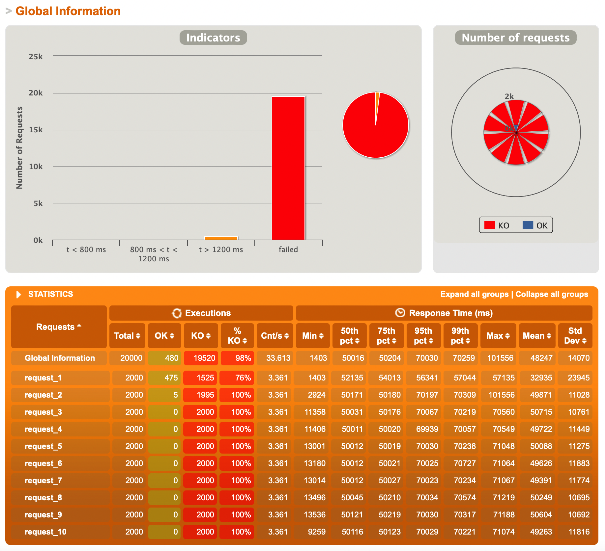

# 实验报告

- 运行环境： Apple M1（ARM架构，16G内存），使用Docker运行POS服务器、Redis集群；
- 压力测试：模拟用户每隔1秒钟将一个商品添加到购物车，总共添加10个商品。


## 1. Docker镜像

使用spring boot的插件可以直接创建Docker镜像：

```shell
$ mvn spring-boot:build-image
```

但是这个指令在ARM架构的电脑上有问题，会编译出x86架构的镜像出来，导致运行非常缓慢。
所以我参考了[Stackoverflow上的这个提问](https://stackoverflow.com/questions/69526553/how-do-i-define-architecture-arm64-when-building-the-docker-image-through-maven)，
改成用自己写的Dockerfile生成镜像，直接运行打包的jar文件，容器就能以较为正常的效率运行了。

测试使用1个POS服务器（限制1CPU运行），分别模拟500个用户和2000个用户同时访问，结果如下：


可以看出2000用户访问时，POS服务器压力大，返回消息的延迟非常大。

## 2. HAProxy横向扩展

使用4个POS服务器，并使用HAProxy镜像做负载均衡，采用轮询（roundrobin）方式平衡负载，运行相同的测试得到如下结果：


从结果中可以看出，500用户时，有大概7%左右的请求的延迟增大，但总体来看性能很好，猜测这个差异可能是由于HAProxy的配置和额外开销导致的。
而2000用户同时访问时，延迟超过1200ms的请求数量从>95%降低到了70%左右，可以看出添加负载均衡提高了处理高密度请求的能力。
如果仔细地调整HAProxy的配置，应该可以获得更好的性能。

此外，在启动4个POS服务器时，出现了500错误，这个错误的原因应该是频繁地请求资源导致京东的服务器切断了链接。
改为手动依次启动4个服务器即可避免触发阈值。

## 3. Redis集群

使用Docker运行6个redis节点构成集群（3个主节点，每个主节点有1个复制集），并配置spring使用redis集群存储session。
运行后同一用户通过负载均衡访问服务，无论分配到哪一个服务器都能获得相同的数据。

使用redis后对系统进行压力测试，得到如下结果：




从截图中可以看出，500用户时的性能大幅度下降，与不使用redis时的2000用户接近；
而2000用户时>95%的请求无法处理，经过查询日志发现是redis请求超时，导致大量的错误和请求积压。
从性能测试结果来看，该redis集群的配置不能够满足2000用户同时高并发的访问要求；
这可能是因为redis集群的数量不足，也可能是运行的6个Redis节点+4个spring服务+HAProxy已经超出了我手上这个丐中丐版M1 CPU的处理能力。

> # WebPOS
>
> The demo shows a web POS system , which replaces the in-memory product db in aw03 with a one backed by 京东.
>
>
> 
>
> To run
>
> ```shell
> mvn clean spring-boot:run
> ```
>
> Currently, it creates a new session for each user and the session data is stored in an in-memory h2 db. 
> And it also fetches a product list from jd.com every time a session begins.
>
> 1. Build a docker image for this application and performance a load testing against it.
> 2. Make this system horizontally scalable by using haproxy and performance a load testing against it.
> 3. Take care of the **cache missing** problem (you may cache the products from jd.com) and **session sharing** problem (you may use a standalone mysql db or a redis cluster). Performance load testings.
>
> Please **write a report** on the performance differences you notices among the above tasks.
